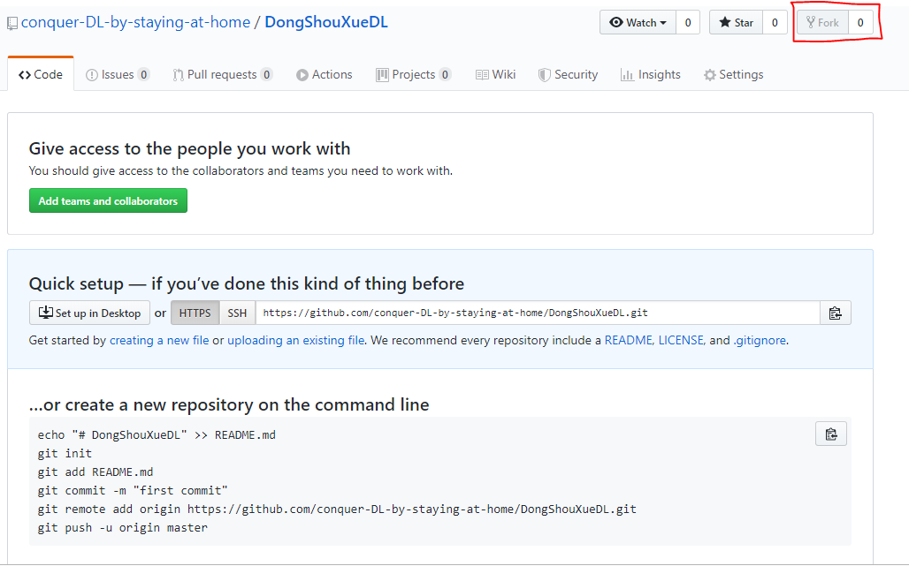
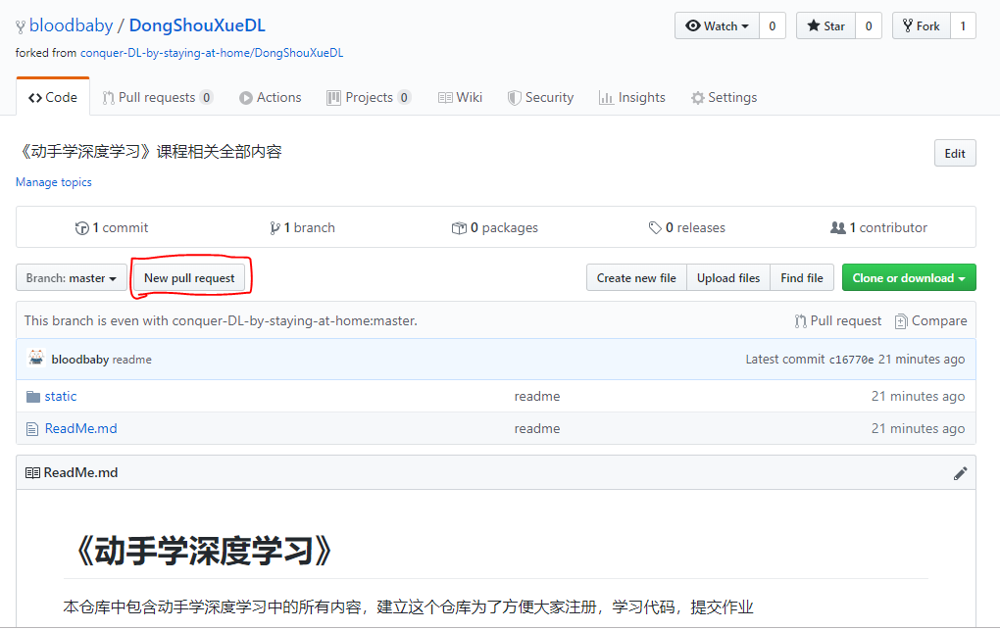
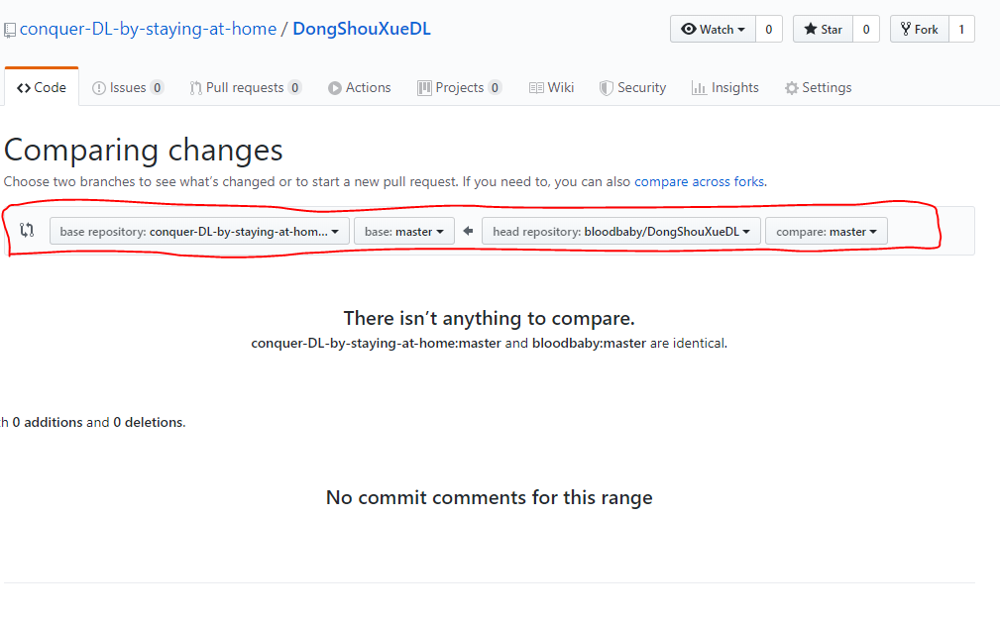

# 贡献指南
<!-- TOC -->autoauto- [贡献指南](#贡献指南)auto    - [如何合理使用git从本仓库拉取更新内容](#如何合理使用git从本仓库拉取更新内容)auto    - [项目机器人说明](#项目机器人说明)auto    - [Slack 交流群组](#slack-交流群组)autoauto<!-- /TOC -->

## 如何合理使用git从本仓库拉取更新内容
1. 首先请fork本仓库 
访问[DongShouXue仓库](https://github.com/conquer-DL-by-staying-at-home/DongShouXueDL)主页，并 Fork 到自己的账号下。


2. Clone仓库
回到自己的 GitHub 主页，并找到刚刚 Fork 过来的 DongShouXue 仓库，进入XXX仓库主页, 将该仓库 clone 到本地，如：
``` git
# 将下面的 XXX 替换成你自己的用户名
$ git clone https://github.com/XXX/DongShouXueDL.git
$ cd DongShouXue
```

3. 新建`branch`
> 非紧急修复，不建议在 master 分支进行开发修改。
根据该分支的用途，起一个恰当的分支名称，新建分支，如：
``` git
git checkout -b my-fix-branch master
```

4. 修改内容，并提交
对相应文件做出修改，修改完成后，提交：
``` git
git add .
git commit -m "message about change"
```
提交时，尽量：

(1) 用一句话清楚的描述这次提交做了什么。

(2) 关联相关 `issue`，如 `fix #1` 、`close #2`、`#3`

如果 `commit` 之后，又做了修改，可以使用 `--amend` 参数：
``` git
git add .
git commit --amend -sm "message about change"
```

5. 同步上游仓库更改
同步上游仓库变更(即 [conquer-DL-by-staying-at-home
/DongShouXueDL](https://github.com/conquer-DL-by-staying-at-home/DongShouXueDL))，因为可能有其他人先于你提交到上游仓库，防止冲突：
``` git
$ git remote add upstream git@github.com:conquer-DL-by-staying-at-home/DongShouXueDL.git
$ git fetch upstream
```
若上游仓库有变更，需要先进行 `rebase`:
``` git
$ git rebase upstream/master
```
6. 推送新分支到自己的远程仓库
``` git
$ git push -f origin my-fix-branch:my-fix-branch
```

7. 提 `Pull Request`
在自己仓库的页面上提`pull request` 到上游仓库。如下图所示.



如果其他人 `review` 之后，需要再进行更改，就修改相关内容，然后执行以下操作，该 `Pull Request` 将会自动同步该 `commit` 。

``` git
$ git add .
$ git commit --amend
$ git push -f origin my-fix-branch
```
8. 如果你的代码合并时出现冲突时，你可以：
> 注：如果未出现冲突，则无需进行以下操作

- 先同步上游仓库变更
``` git
git fetch upstream
```
- 进行`rebase`:
``` git
git rebase upstream/master
```
- 手动解决冲突内容，之后重新提交：
``` git
git add my-fix-file
git rebase --continue
git push -f origin my-fix-branch
```

9. 当你的代码被合并进去以后，你可以：
- 切回到 `master` 分支：
``` git
git checkout master -f
```
- 保持本地 `master ` 分支与上游分支同步：
``` git
git pull --ff upstream master
```
- 删除本地分支(可选):
``` git
git branch -D my-fix-branch
```
- 删除远程分支(可选)：
``` git
git push origin --delete my-fix-branch
```
## 项目机器人说明
---
待定

## Slack 交流群组
---
待定