# 课后练习

###  1. 线性回归
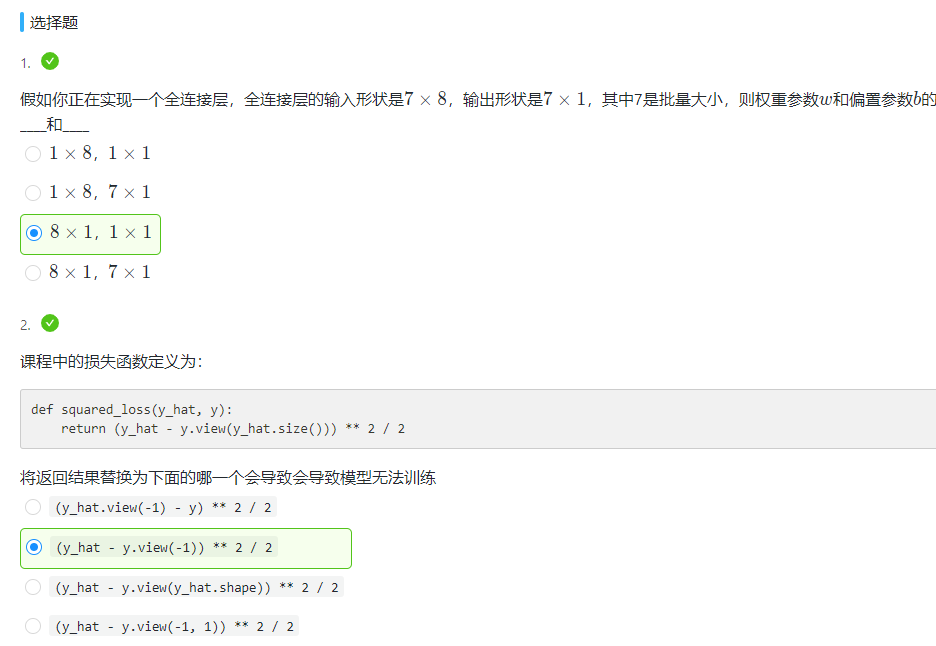
多出来的新填空题答案为：0.112

###  2. Softmax与分类模型
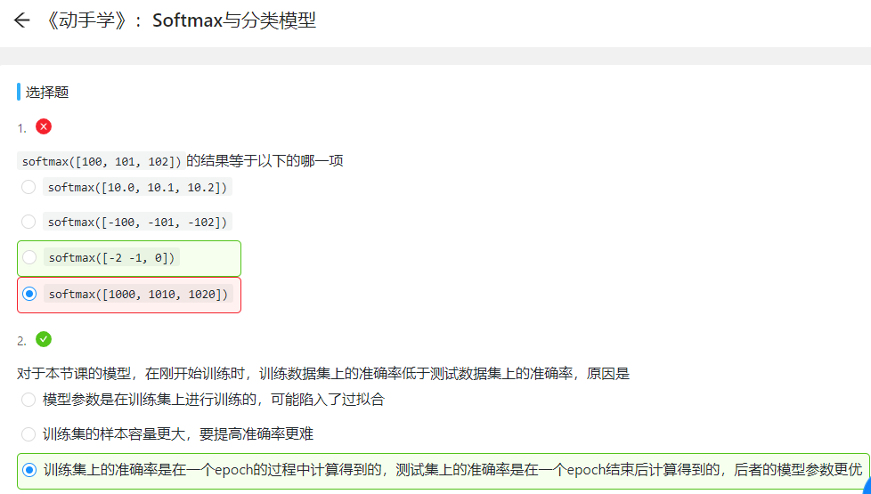
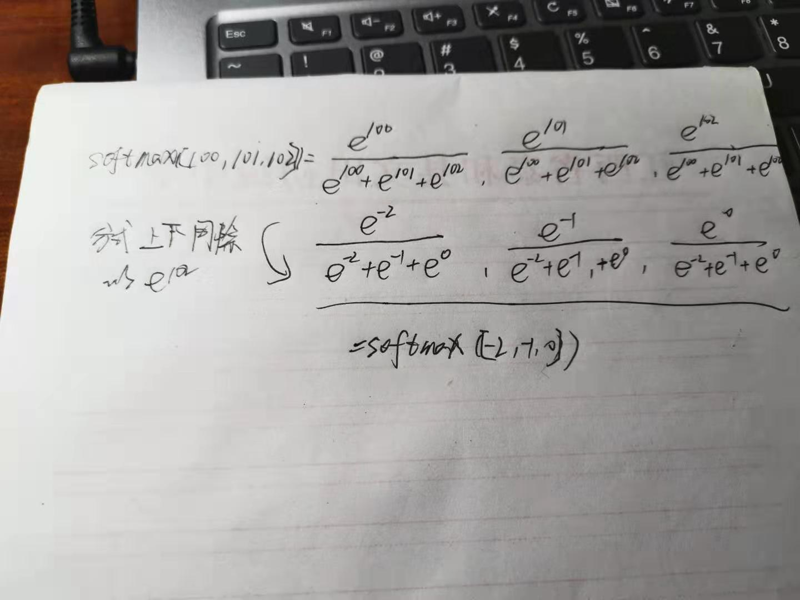

###  3. 多层感知机
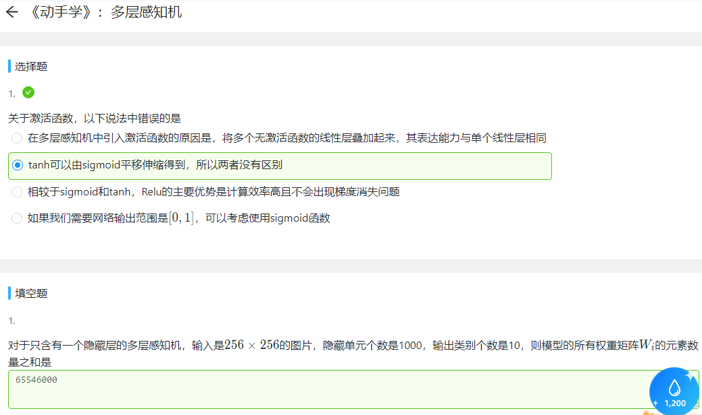

###  4. 文本预处理
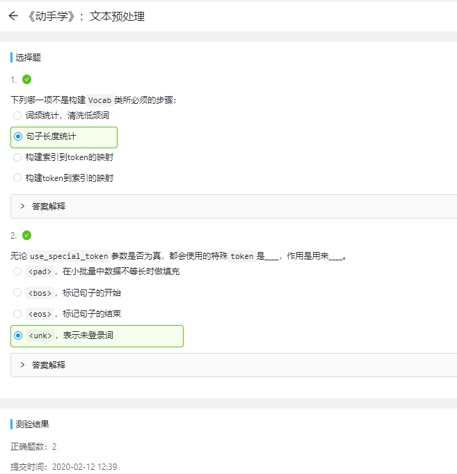

###  5. 语言模型
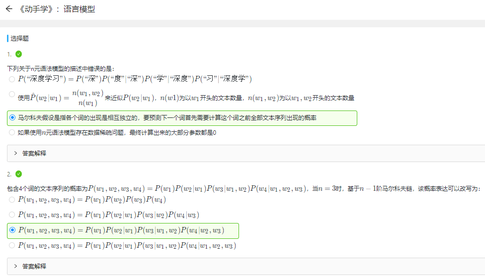
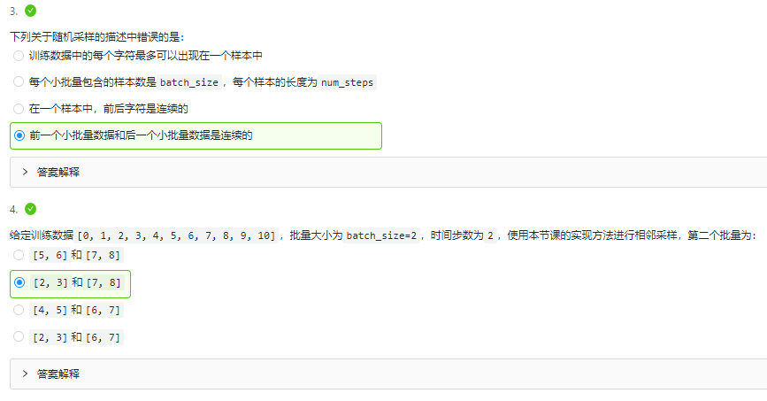

###  6. 循环神经网络基础
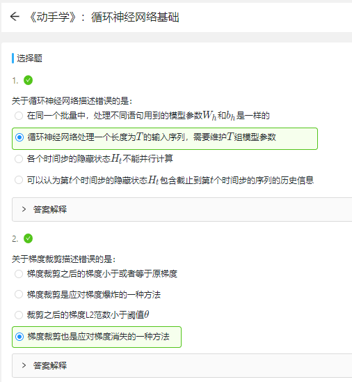
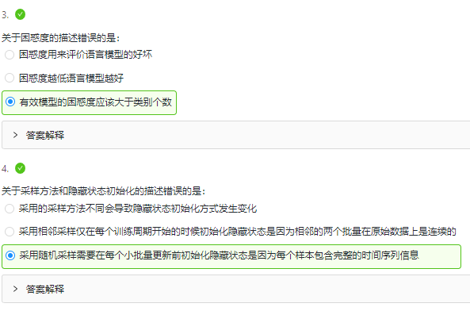

###  7. 过拟合、欠拟合及其解决方案
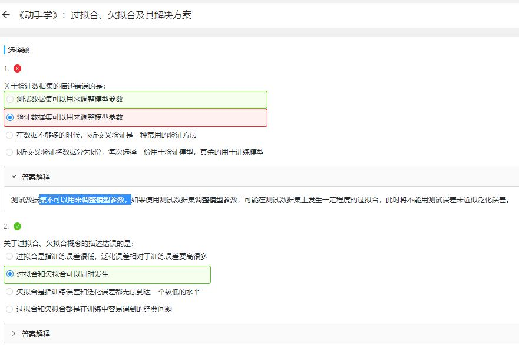
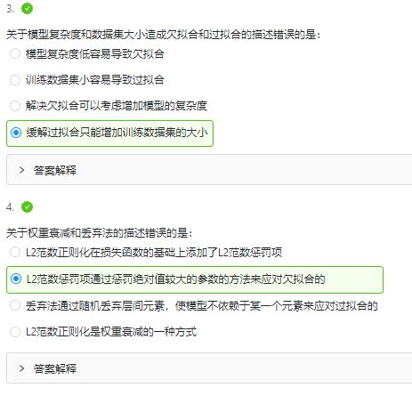

###  8. 梯度消失、梯度爆炸
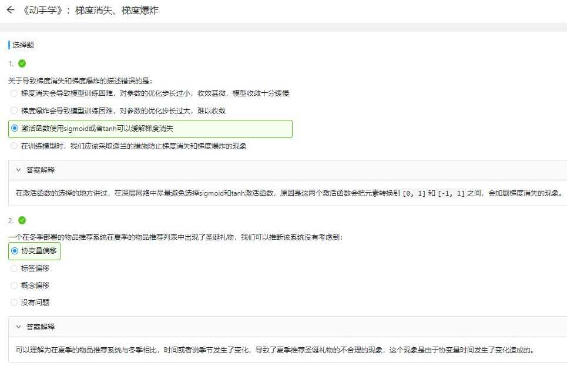
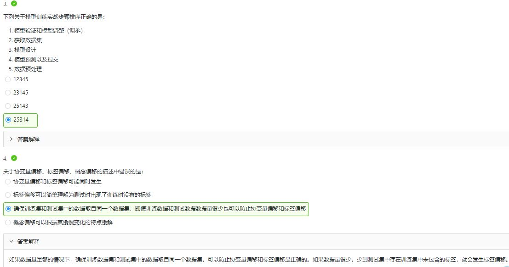

###  9. 循环神经网络进阶
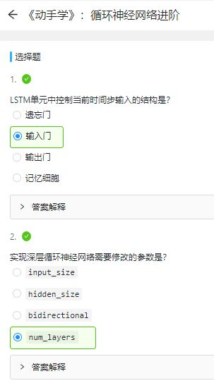
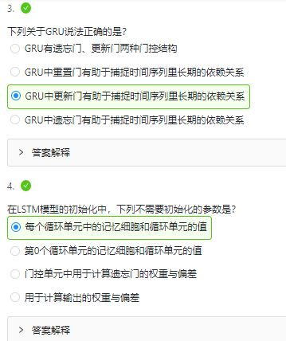
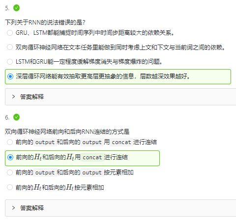

### 10. 机器翻译及相关技术
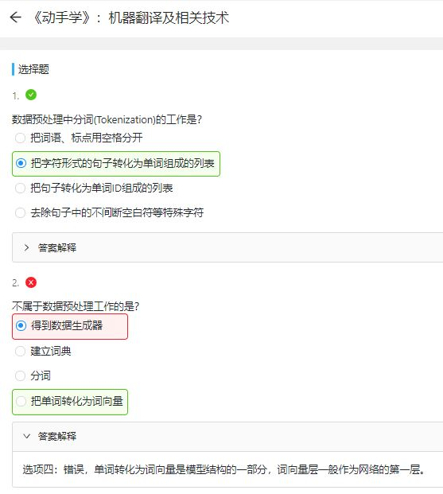
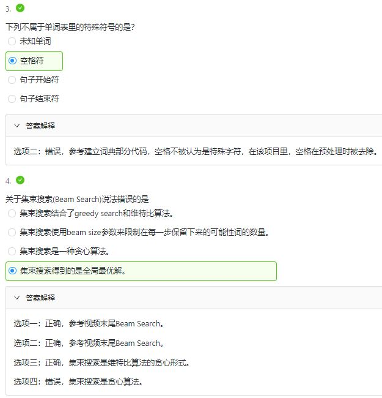
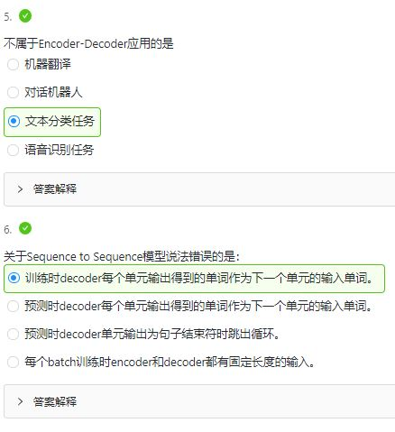

### 11.注意力机制和Seq2Seq模型

### 12.Transformer

### 13.卷积神经网络基础

### 14.LeNet

### 15.卷积神经网络进阶

