# 课后练习

###  1. 线性回归

多出来的新填空题答案为：0.112

###  2. Softmax与分类模型

###  3. 多层感知机

###  4. 文本预处理

###  5. 语言模型

###  6. 循环神经网络基础

###  7. 过拟合、欠拟合及其解决方案

###  8. 梯度消失、梯度爆炸

###  9. 循环神经网络进阶

### 10. 机器翻译及相关技术

### 11.注意力机制和Seq2Seq模型
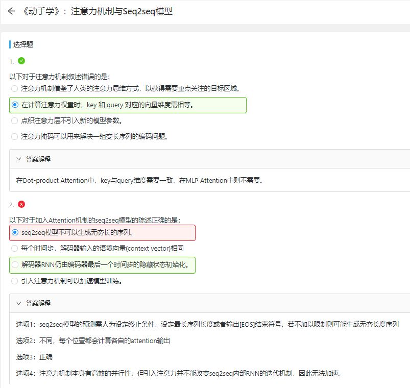
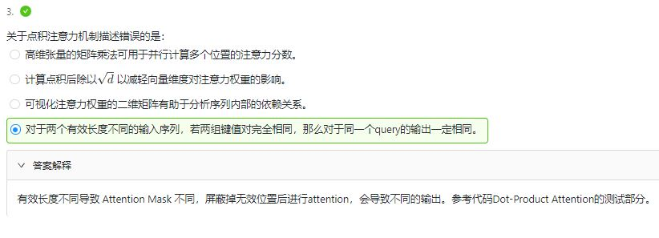

### 12.Transformer
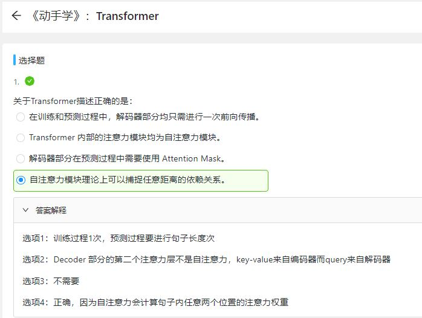
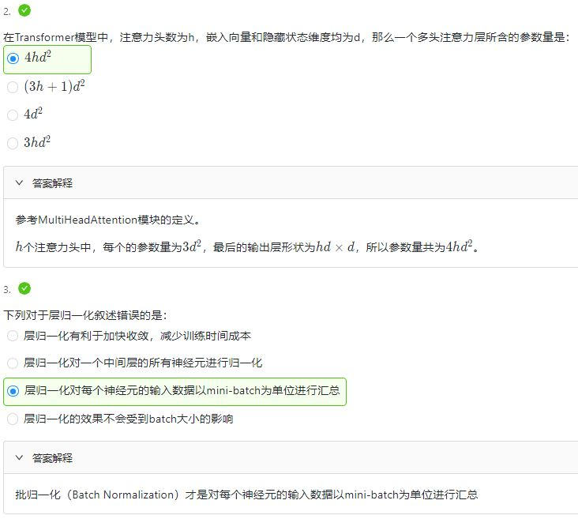

### 13.卷积神经网络基础
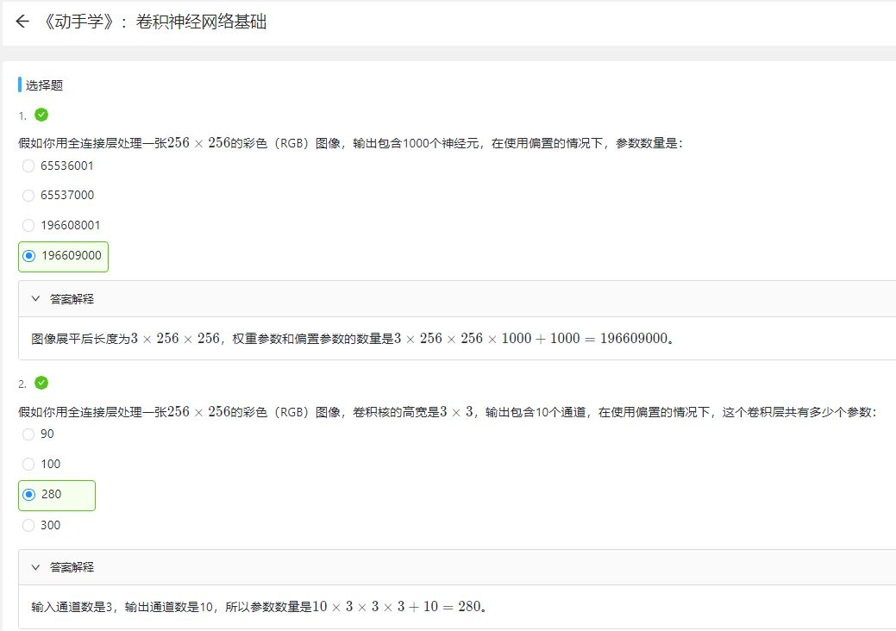
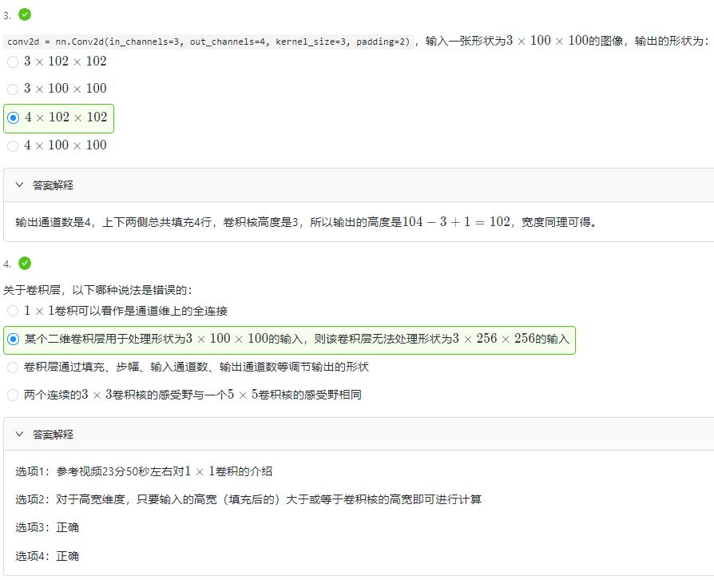
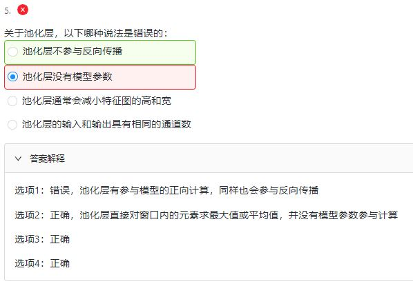

### 14.LeNet
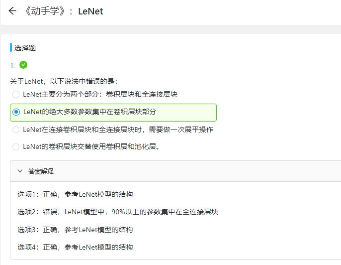
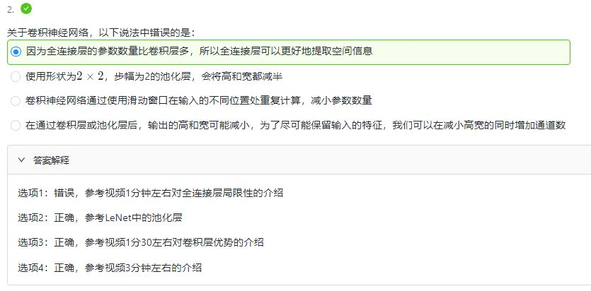

### 15.卷积神经网络进阶

### 16.批量归一化和残差网络
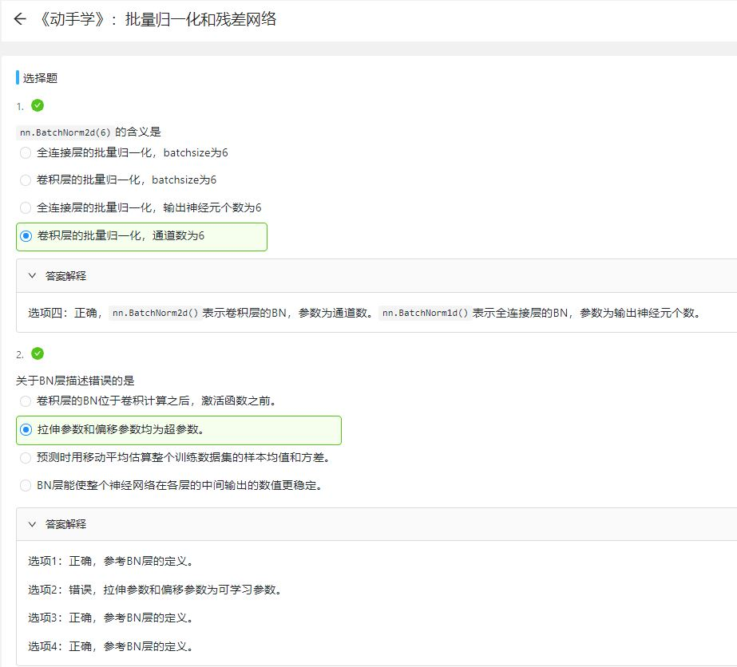
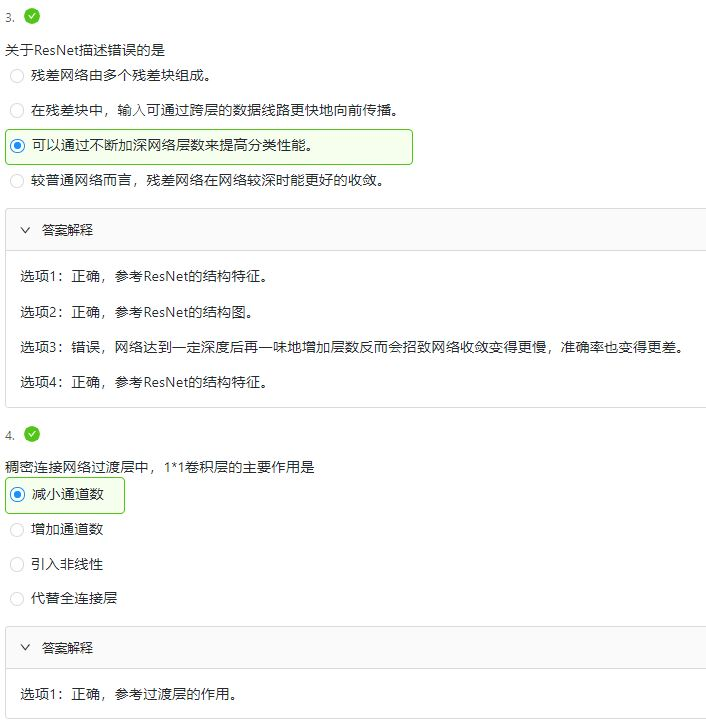

### 17.凸优化
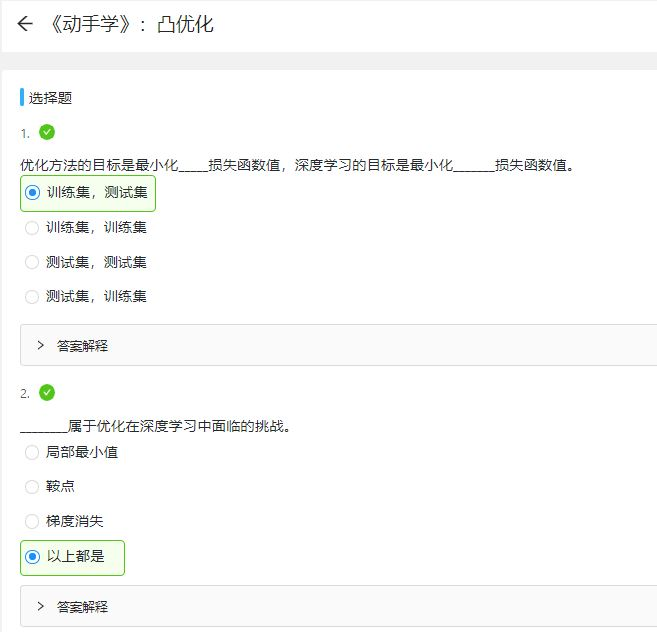
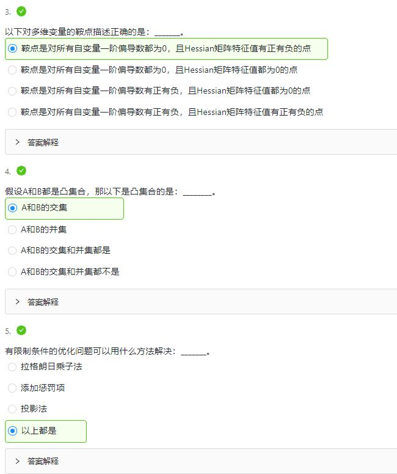

### 18.梯度下降
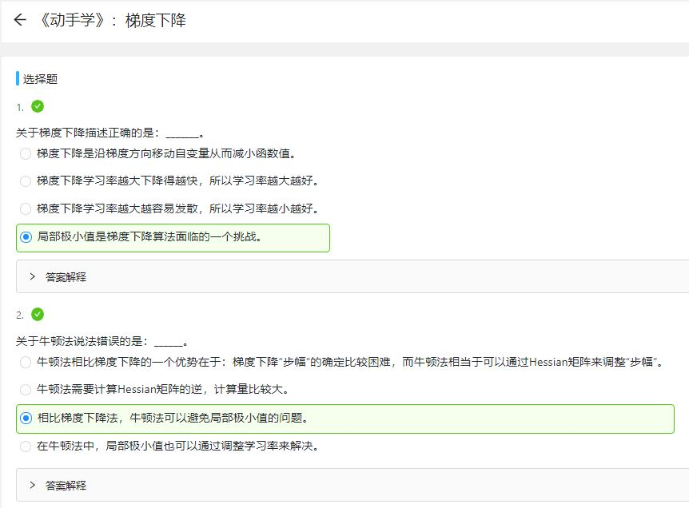
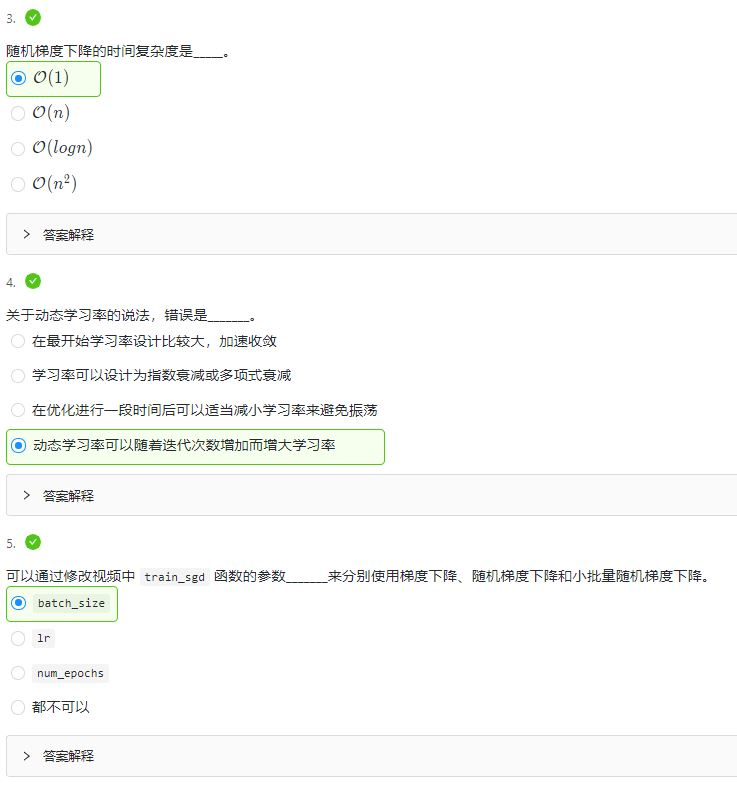
